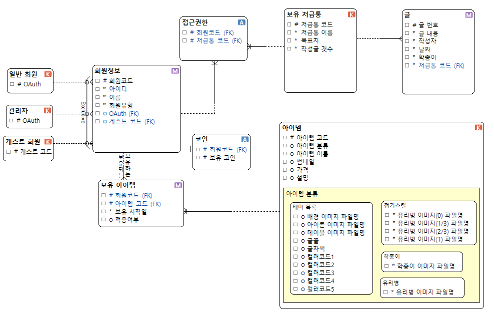
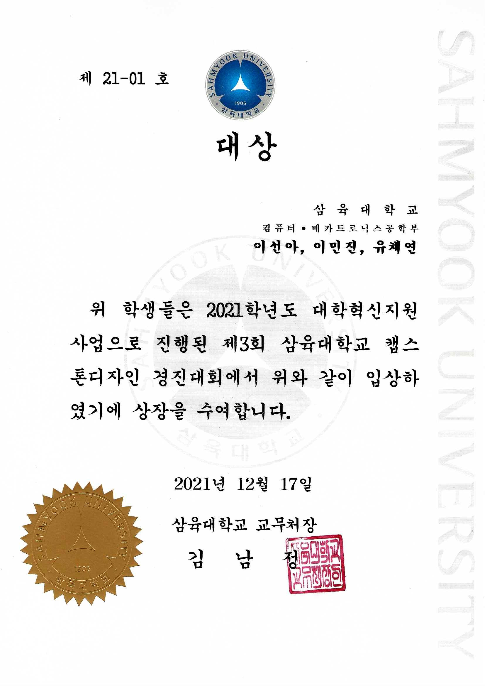

# 행복한 기억 보관소 "하루, 행복" 입니다
## 개발자
### 팀 ZIZIZU
- [이선아(SeonA Lee)](https://github.com/princesssuna)
- [유채연(ChaeYeon Yu)](https://github.com/ycyeon)
- [이민진(MinJin Lee)](https://github.com/3tPepper)

## 하루, 행복 사이트
[하루, 행복](http://dailyhappy.kro.kr)


## 개요
&nbsp;우리는 모두 행복했던 기억이 하나쯤 있을 것입니다. 과반수의 사람들이 행복했던 기억들을 떠올리면 다시 한 번 행복을 느끼고, 부정적인 감정을 느낄 때 긍정적인 생각을 하는 것이 도움이 된다고 답하였습니다. 

&nbsp;그렇지만 우리의 뇌는 이런 행복했던 기억들을 전부 기억하기는 어렵습니다.
기억은 기록을 이길 수 없습니다. 그래서 저희는 ```‘행복을 담는 유리병’```을 기획하게 되었습니다. 

&nbsp;행복을 담는 유리병이란 살면서 행복하거나 좋았던 기억들을 학종이에 접어 유리병에 보관해두었다가, 힘들고 지칠 때 랜덤으로 펼쳐보며 자신을 위로할 수 있게 도움을 주는 어플리케이션입니다.
이 어플리케이션을 통해 행복했던 순간을 잊지 않고, 일상에 지친 사용자들에게 버팀목이 되었으면 합니다.

또한 훗날, 청소년 상담이나 우울증 개선, 갱년기 여성을 대상으로 사회 복지 차원에서 활용될 수 있을 것이라 기대합니다.

[발표 PPT](https://github.com/Daily-Happy-Project/Daily-Happy/blob/main/Image/하루행복%20PPT.pdf)

## 개발환경
- Eclipse
- [Github](https://github.com/Daily-Happy-Project/Daily-Happy)
- [Notion](https://www.notion.so/ae6e5931100b48f2ac52338c7aaa83bb)

## 사용기술
### Backend

**Spring Maven**
- JAVA 8
- Spring MVC
- JSP

**Database**
- MySQL

**Server**
- KT cloud

### Frontend
- Javascript
- JSP
- HTML/CSS

## 데이터모델링


## Copyright
[Copyright 2021. princesszizonganzi(ZIZIZU) all rights reserved.](https://github.com/Daily-Happy-Project/Daily-Happy/blob/main/DailyHappy/WebApp/views/copyrightView.jsp)

## 수상 이력

**삼육대학교 캡스톤디자인 경진대회 대상 수상**

## 문의 사항
문의 사항은 이메일 ```princesszizonganzi@gmail.com``` 로 보내주세요.

## 안드로이드 어플 출시일 (예정)
**미정**

<br/>


